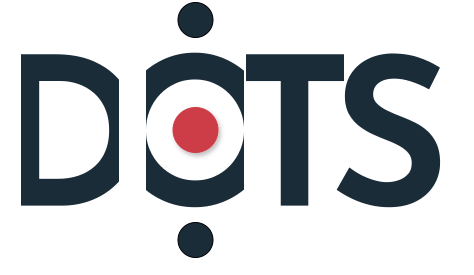

# Documentation Home

## What is DoTS?

DoTS is an XQuery implementation of DTS running on <a href="https://basex.org/" target="_blank">BaseX</a>.

DoTS makes it easy to share XML/TEI collections according to FAIR principles.

!!! Note

    **DoTS supports only DTS GET requests** for browsing collections, document retrieval and navigation.

## What is DTS?

The <a href="https://distributed-text-services.github.io/specifications" target="_blank">Distributed Text Services</a> (DTS) Specification defines an API for working with collections of text as machine-actionable data.

Publishers of digital text collections can use the DTS API to help them make their textual data Findable, Accessible, Interoperable and Reusable (<a href="https://www.ccsd.cnrs.fr/principes-fair/" target="_blank">FAIR</a>).

## Capabilities

With DoTS, you can:

- Using the DTS Collection endpoint:
	- Retrieve lists of collection members.
	- Retrieve metadata about individual collection members.
- Using the DTS Navigation endpoint:
	- Retrieve lists of citable passages within a text.
	- Retrieve a range of citable passages within a text.
	- Retrieve metadata about a document's citation structure.
- Using the DTS Document endpoint:
	- Retrieve a single text passage at any level of the citation hierarchy.
	- Retrieve a range of text passages between a specified start and end passage.
	- Retrieve an entire text.

## Source code

- <a href="https://github.com/dots-suite/dots" target="_blank">https://github.com/dots-suite/dots</a>
- The current version is compliant with [version 1.0](https://dtsapi.org/specifications/versions/v1.0/) of the DTS specification.

## Try DoTS

- [Swagger UI](api.md) ;
- [DTS demo endpoint](https://dots.chartes.psl.eu/demo/api/dts/): the collections made available through the endpoint are presented in the [cookbook](cookbook/index.md).

## Credits

DoTS is developed by the *Mission projets numériques* de l’[École nationale des chartes - PSL](https://www.chartes.psl.eu/) with the support of [Biblissima+](https://projet.biblissima.fr/fr).

